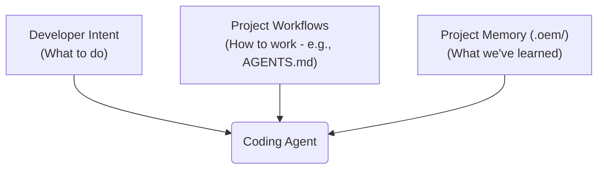
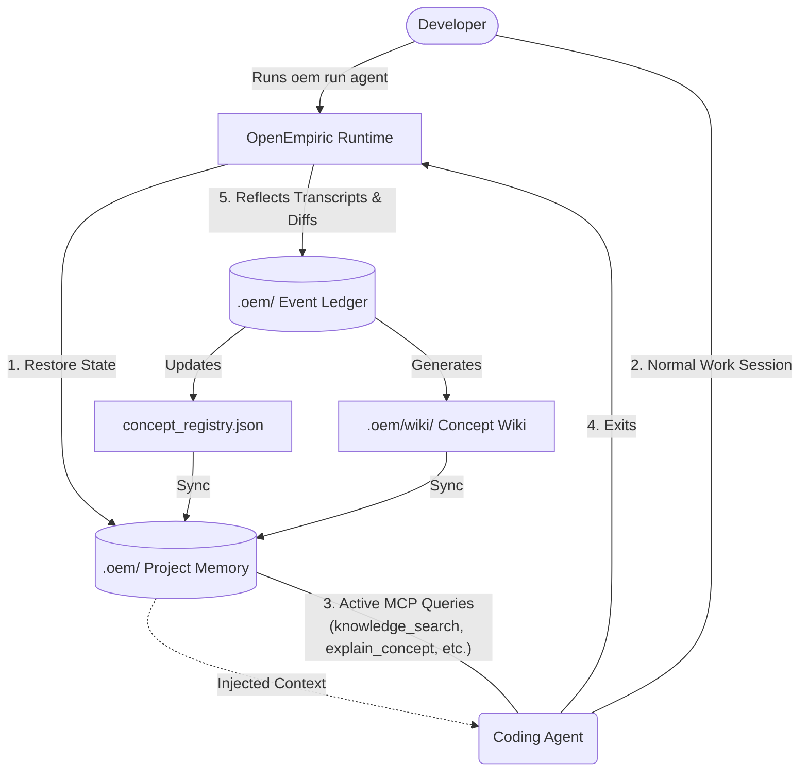

<p align="center">
  
</p>

<p align="center">
  <strong>The agent-first, event-sourced knowledge runtime for AI coding sessions.</strong>
</p>

<p align="center">
  <a href="https://github.com/xpajonx/openempiric/blob/main/LICENSE"></a>
  <a href="https://python.org"></a>
  <a href="https://github.com/astral-sh/uv"></a>
</p>

---

## What is OpenEmpiric?

**OpenEmpiric (OEM)** is a local-first, agent-first learning runtime. It acts as long-term memory for your AI coding agents, capturing crucial architectural decisions, experiments, tradeoffs, failures, and outcomes directly from your developer-agent conversations. It stores this knowledge in an event-sourced ledger and structures it as a local knowledge graph, making it immediately available to guide future coding sessions.

Instead of writing and updating guidelines manually, you simply work with your agent. OEM automatically builds your project's memory map, preventing your agent from making the same mistake twice.

---

## How it Works

OpenEmpiric shifts the model of AI coding sessions from a simple wrapped process to an **active knowledge infrastructure**. It is best explained through two layers: the user mental model (why it exists) and the internal runtime flow (how it works).

### 1. User Mental Model (Why OEM Exists)

Rather than just receiving static prompts, a highly productive AI coding agent relies on three balanced pillars:
* **Developer Intent**: The immediate task, constraints, and goals you provide.
* **Project Workflows** (e.g., `AGENTS.md` / `CLAUDE.md`): Guidelines detailing *how* the project is structured, run, and styled.
* **Project Memory** (e.g., `.oem/`): The persistent knowledge layer managed by **OpenEmpiric**, recording *what has been learned* (prior decisions, resolved failures, validated designs).



---

### 2. Internal Runtime & Tooling Flow (How OEM Works)

The `.oem/` directory at the project root acts as the center of gravity. During execution, the coding agent actively queries this memory infrastructure using MCP tools rather than just reading static startup files.



---

## Key Features

- **🧠 Zero-Config Agent Memory**: No manual updates or prompt-engineering required. OEM learns continuously in the background.
- **🔄 Automatic Reflection**: Analyzes chat transcripts and file diffs to automatically extract new concepts, decisions, experiments, and root causes of failures.
- **🛡️ Secure File System Guards**: SFS wrapper protects the host workspace with strict path-traversal limits and truncation protection (prevents agents from accidentally erasing large files).
- **🔎 Local RAG Retrieval**: Perform hybrid vector-BM25 search queries across your project's memory repository locally.
- **📚 Materialized Wiki**: Auto-generates clean, human-readable markdown documentation in `.oem/wiki/` as the knowledge graph evolves.

---

## Quick Start

### 1. Install Globally

Install the unified `oem` CLI runtime globally using `uv` with semantic retrieval support:

```bash
uv tool install "git+https://github.com/xpajonx/openempiric.git#subdirectory=packages/oem-knowledge[semantic]"
```

For a lighter BM25-only install, you can omit `[semantic]`, but the default user path assumes semantic retrieval is available when possible.

### 2. Setup Agent Integration

Register your preferred agent integration with OpenEmpiric.

For terminal-based workstation environments (like OpenCode):
```bash
oem setup opencode
```

For desktop-based non-terminal environments (like Codex App):
```bash
oem setup codex-app
```

### 3. Launch a Session

From any project directory, launch a managed session:
```bash
mkdir demo-project
cd demo-project
oem run opencode
```

`oem run opencode` bootstraps the project-local `.oem/` memory folder automatically and starts a managed session.

*(Note: For Codex App, standard MCP tools are configured automatically. The agent uses the `knowledge_session_end` conversational tool to commit and persist learnings at the end of a session).*

### 4. Diagnose Problems

Verify your workspace integration and bridge health:
```bash
oem doctor
```

---

## Supported Agents & Custom Adapters

OpenEmpiric officially supports the following agent runtimes out-of-the-box:

- **OpenCode**: Workstation-level integration, native plugins, and session supervisor for terminal environments.
- **Antigravity**: Terminal co-pilot and command-line companion integration.
- **Codex App**: First-class MCP-based non-terminal desktop runtime, configured automatically via the WSL bridge architecture (`oem setup codex-app`).

### Extensibility: Write Your Own Adapter!
You can easily extend OpenEmpiric to support other environments (such as Claude Code, Cursor, or your own proprietary CLI agent). All you need to do is subclass the base adapter:

```python
from oem_knowledge.adapters.base import BaseAdapter
from oem_knowledge.adapters.registry import register_adapter

@register_adapter("my-custom-agent")
class MyCustomAgentAdapter(BaseAdapter):
    def verify_mcp(self) -> bool:
        # Check if agent is installed and configured
        return True

    def parse_transcript(self, transcript_path) -> str:
        # Extract dialogue text from agent logs
        return transcript_path.read_text()
```

Refer to the [Adapter Architecture Guide](docs/adapter-architecture.md) and [Adapter Specification](docs/adapter-spec.md) for details.

---

## CLI Command Reference

| Command | Category | Description |
|---|---|---|
| `oem run <agent>` | **User** | Run a managed coding agent session with context injection. |
| `oem setup <target>` | **User** | Configure and register integrations (`opencode` or `codex-app`). |
| `oem doctor` | **User** | Verify workspace health, plugin links, model warmup, and agent integrations. |
| `oem search <query>` | **User** | Search the project knowledge base using automatic/BM25/hybrid retrieval. |
| `oem health` | **User** | Scan the workspace for stale concepts, duplicates, and contradicting knowledge. |
| `oem config retrieval <mode>` | **User** | View or set retrieval strategy to `auto`, `bm25`, or `hybrid`. |
| `oem init` | **Admin** | Initialize the `.oem/` memory repository in the current workspace. |
| `oem migrate` | **Admin** | Migrate legacy `.harness/` directory to `.oem/` format. |
| `oem mcp` | **Admin** | Start the background MCP tool server for non-terminal runtimes. |
| `oem merge <id1> <id2>` | **Advanced** | Manually merge two overlapping or duplicate concepts. |
| `oem rebuild` | **Advanced** | Replay the event store log to rebuild the entire concept registry. |
| `oem reflect` | **Advanced** | Dry-run reflection and concept extraction from raw transcripts. |

---

## MCP Tool Reference

When integrated as an MCP server, OpenEmpiric exposes the following tools to the AI agent to support context injection, memory retrieval, task tracking, and session commitment:

### Core Retrieval & Exploration
* **`knowledge_search(query: str, k: int, project: str)`**: Perform hybrid semantic and keyword search across concepts.
* **`knowledge_explain_concept(concept_id: str, project: str)`**: Retrieve full markdown documentation, canonical name, and recent learnings/evidence for a concept.
* **`knowledge_graph_query(concept_id: str, direction: str, project: str)`**: Query semantic relationships (incoming/outgoing/both) between concept nodes.
* **`knowledge_stats(project: str)`**: View high-level statistics of the knowledge base and local vector database size.

### Session Lifecycle & Telemetry
* **`knowledge_session_end(project: str, conversation_text: str, session_id: str)`**: Ends the session, runs transcript analysis and git diff extraction to update concept records, and commits all changes. Returns a clean markdown summary report.
* **`knowledge_usage_report(concepts_used: list[str], concepts_ignored: list[str], decisions: list[str], project: str)`**: Reports telemetry regarding concept usage and decision alignment during a session.
* **`knowledge_health_check(stale_sessions: int, similarity_threshold: float, project: str)`**: Propose duplicate merges, find stale concepts, and detect contradictions.

### Task / TODO Management
* **`oem_todo_read(workdir: str)`**: View the active session task checklist from `.oem/state/todos.json`.
* **`oem_todo_write(items: str, workdir: str)`**: Overwrite the todo list with a new JSON list of items.
* **`oem_todo_advance(item_id: str, status: str, workdir: str)`**: Update a task's status (`pending`, `in_progress`, `completed`) and automatically cycle next items.

### Concept Management & Verification
* **`knowledge_consolidate(project: str)`**: Identify and merge duplicate and overlapping concept nodes automatically.
* **`knowledge_merge_concepts(project: str, primary_id: str, secondary_id: str)`**: Manually merge a secondary concept into a primary concept.
* **`knowledge_lint(project: str, max_parallel: int, fix: bool)`**: Find broken/orphan concept links and automatically heal matching aliases.

---

## How It Learns: High-Value Cues

OEM works automatically, but it extracts the highest-quality knowledge when developers state reasoning and results explicitly during a conversation.

| Concept Signal | Better (OEM Captures Rationale) | Worse (Vague/Context-Free) |
|---|---|---|
| **Decisions** | *"We decided to use TypeScript because Python startup latency caused MCP timeouts."* | *"Use TypeScript."* |
| **Failures** | *"The pagination job failed because the pagination cursor was not reset between retries."* | *"Pagination is broken."* |
| **Tradeoffs** | *"We chose client-side caching to avoid Redis dependency, accepting up to 5 minutes of stale data."* | *"Use client-side cache."* |
| **Experiments** | *"We tested BM25 vs hybrid search. Hybrid scored 23% higher on recall@5, so we made it default."* | *"Hybrid search works better."* |
| **Outcomes** | *"Restructuring the DB index reduced retrieval latency from 5.5s to 450ms."* | *"Looks faster now."* |

Check out the [Best Practices Guide](docs/best-practices.md) for more details.

---

## Repository Anatomy

- [packages/oem-knowledge](packages/oem-knowledge) — Core RAG logic, SQLite event database, extraction services, and CLI.
- [packages/oem-tui](packages/oem-tui) — Terminal UI layout and visual dashboard modules.
- [plugins](plugins) — Native TypeScript plugins for IDE/workstation agent integrations.
- [docs](docs) — Complete specifications, architecture details, and lifecycle logs.
